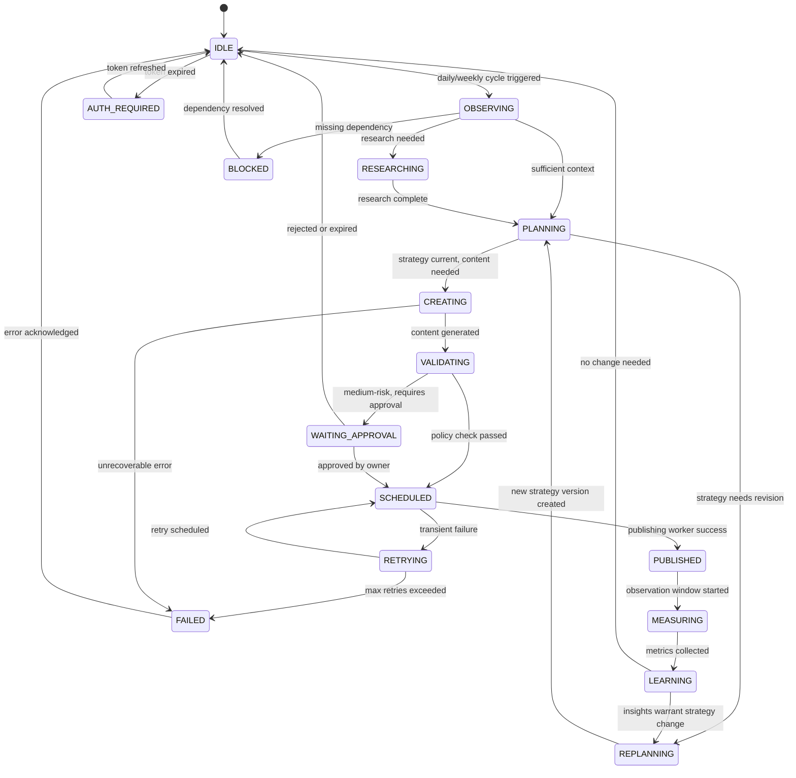
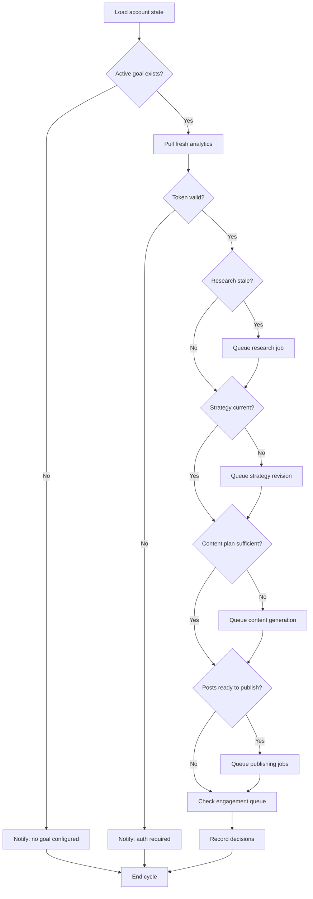

# Evolvr — Agent Design

> This document describes the agent architecture, tools, state machine, and decision loop.

---

## Design Philosophy

> Do NOT create dozens of independent LLM agents simply for the sake of calling them agents.

Evolvr uses a **small set of specialized logical agents** coordinated by a central orchestrator. Each agent module has a clear responsibility and uses the LLM only for tasks that genuinely require reasoning.

```
Orchestrator (decision engine)
├── Research Agent
├── Strategy Agent  
├── Content Agent
├── Analytics Agent
├── Learning Agent
└── Engagement Agent
```

---

## Agent State Machine



---

## 1. Orchestrator

The orchestrator is the central decision engine. It does **not** generate content or conduct research — it decides what needs to happen next and delegates.

### Decision Output Format

```json
{
  "decision": "GENERATE_CONTENT_PLAN",
  "reason": "Current weekly plan is below target. Educational reels outperformed product posts 2.4× on share rate over last 12 posts.",
  "priority": "high",
  "evidenceIds": ["insight_abc123", "post_metrics_xyz789"],
  "confidence": 0.84,
  "nextActions": ["content-generation", "quality-check"]
}
```

### Orchestrator Decision Logic



---

## 2. Research Agent

### Purpose
Gather and synthesize information relevant to the current strategic uncertainty — not just "what's trending today."

### Research Question Generation
Before running research, the Research Agent inspects:
- Current strategic hypotheses (what are we unsure about?)
- Recent experiment results (what needs validation?)
- Analytics anomalies (what unexpected patterns need explanation?)
- Content mix gaps (what topics haven't we covered recently?)

### Research Categories

| Category | Example Questions |
|----------|------------------|
| **Trend** | Which content angles are gaining traction in [niche] this week that overlap with our top-performing themes? |
| **Competitor** | What is [competitor] posting that generates their highest save rates? |
| **Audience** | What questions are [audience segment] asking in comments and communities? |
| **Content** | Find examples of [format] posts that use [hook type] effectively in [niche] |
| **Platform** | Are there any recent Instagram algorithm updates affecting [content type]? |

### Output Structure

```json
{
  "category": "trend",
  "query": { "questions": [...], "rationale": "..." },
  "sources": [
    {
      "sourceUrl": "https://...",
      "title": "...",
      "domain": "...",
      "fetchedAt": "...",
      "excerptOrSummary": "...",
      "credibilityNotes": "Primary source / official announcement"
    }
  ],
  "synthesizedFindings": {
    "summary": "...",
    "keyInsights": ["...", "..."],
    "actionableRecommendations": ["...", "..."],
    "confidenceLevel": "medium",
    "limitationsAndCaveats": ["Small sample size", "Competitor data indirect"]
  }
}
```

---

## 3. Strategy Agent

### Purpose
Translate admin goals into a measurable, evidence-backed content strategy. Revise strategy when evidence supports change — not reactively on every small data point.

### Strategy Version Structure

```json
{
  "objective": {
    "primaryMetric": "followers",
    "secondaryMetrics": ["reach", "shares", "profile_visits"],
    "targetGrowthRate": 0.15,
    "rationale": "Goal requires 10K followers by target date"
  },
  "contentMix": {
    "education": 0.40,
    "storytelling": 0.25,
    "trend": 0.15,
    "product": 0.10,
    "community": 0.10
  },
  "cadence": {
    "reelsPerWeek": 4,
    "carouselsPerWeek": 2,
    "storiesPerWeek": 5,
    "staticPostsPerWeek": 1
  },
  "experimentPlan": ["curiosity_hooks_vs_descriptive", "7pm_vs_9am_posting"]
}
```

### Strategy Revision Threshold

A strategy revision is triggered only when:
- Minimum 10 posts have been published under the current strategy version, AND
- At least one of:
  - A content format is consistently performing >30% above/below baseline (10+ samples)
  - An experiment has concluded with >75% confidence
  - A significant insight has been validated by multiple independent posts

### Evidence Requirements

All strategy changes must cite evidence:
```
"rationale": "Educational reels generated 2.4× the median share rate over last 12 posts (posts: [id1, id2, id3...]). Product posts underperformed by 40%. Hypothesis H-12 confirmed at 78% confidence."
```

---

## 4. Content Agent

### Purpose
Generate content grounded in strategy, audience understanding, and evidence — not randomly.

### Content Generation Hierarchy

```
Goal → Pillar → Audience Pain/Desire → Angle → Format → Hook → Body → CTA → Experiment Tag
```

### Content Scoring

Each idea is scored on 7 dimensions (0–1 scale):

| Dimension | Source | Weight |
|-----------|--------|--------|
| Strategy fit | Deterministic: pillar match vs content mix | 0.25 |
| Audience fit | LLM: relevance to target audience pain points | 0.20 |
| Evidence strength | Deterministic: backed by insights/experiments | 0.15 |
| Novelty | Deterministic: similarity to recent posts | 0.15 |
| Predicted engagement | Historical: avg engagement for format/pillar | 0.10 |
| Predicted reach | Historical: avg reach for format/hook type | 0.10 |
| Brand safety | LLM: alignment with voice and constraints | 0.05 |

**Aggregate score**: Weighted combination. Posts below 0.5 threshold are regenerated.

### Content Types

| Format | Asset Requirements | Generation Method |
|--------|-------------------|------------------|
| Reel | Video + audio (or visual script) | Script + asset brief |
| Carousel | 3-10 slide images | Slide outline + text copy |
| Static Post | Single image | Caption + image brief |
| Story | Image or video | Brief + copy |

---

## 5. Analytics Agent

### KPI Calculation Rules

All KPI calculations are **deterministic** — never delegated to LLM.

```typescript
engagementRate = (likes + comments + shares + saves) / reach
shareRate = shares / reach
saveRate = saves / reach
commentRate = comments / reach
profileVisitRate = profile_visits / reach
followConversionRate = follows / profile_visits
```

### Baseline Comparison

Each post's metrics are compared against:
1. **Account 30-day median** — the account's rolling typical performance
2. **Format-specific median** — typical performance for this format
3. **Pillar-specific median** — typical performance for this content pillar

### Anomaly Detection

The agent flags anomalies when a metric is >2 standard deviations from the rolling median. Anomalies trigger:
1. In-app notification
2. Additional analytics collection job (to verify it's not a data artifact)
3. Research job (if anomaly is positive: "what caused this outperformance?")

---

## 6. Learning / Optimization Agent

### Insight Lifecycle

```
Observation (single post outperforms)
    ↓
Pattern (multiple posts show same pattern)
    ↓
Hypothesis (formalized testable statement)
    ↓
Experiment (controlled test)
    ↓
Insight (confirmed pattern with confidence score)
    ↓
Strategy Update (content mix / cadence change)
```

### Confidence Scoring

```
low:    < 0.5   (1-3 data points, no controlled experiment)
medium: 0.5-0.75 (4-9 data points or 1 confirmed experiment)
high:   > 0.75  (10+ data points or 2+ confirmed experiments)
```

### Language Guardrails

The Learning Agent is required to use hedged language:

❌ **Forbidden**: "This hook caused 40% more reach"  
✅ **Required**: "This hook is associated with higher reach in the current sample (n=6). Confidence: low."

---

## 7. Engagement Agent

### Comment Processing Pipeline

```
Fetch comments
    ↓
Filter duplicates (by platform_comment_id)
    ↓
Classify: sentiment + intent + risk_level
    ↓
Priority queue: questions > appreciation > other > spam
    ↓
Draft responses for non-spam, low/medium risk
    ↓
Auto-reply: low-risk + appreciation only (if enabled)
    ↓
Queue for approval: questions, medium risk
    ↓
Ignore: spam
```

### Auto-Reply Safety Rules

Auto-replies are only sent when ALL of these are true:
1. Comment risk level is `low`
2. Comment intent is `appreciation` or simple non-complex `question`
3. Response draft has been scored ≥ 0.8 by the brand voice check
4. Response does not contain: prices, claims, competitor mentions, medical/legal/financial info
5. Autonomy mode is `supervised` or `autonomous`
6. The policy engine returns `ALLOW`

---

## Tool Registry

Each tool has: schema, authorization policy, risk level, idempotency rules.

| Tool | Agent | Risk | Schema |
|------|-------|------|--------|
| `search_web` | Research | Low | `{ query: string, category: ResearchCategory }` |
| `get_account_metrics` | Analytics, Orchestrator | Low | `{ range: DateRange }` |
| `get_post_metrics` | Analytics | Low | `{ postId: UUID }` |
| `get_recent_posts` | Orchestrator, Content | Low | `{ limit: number, status?: PostStatus }` |
| `get_comments` | Engagement | Low | `{ postId: UUID }` |
| `create_content_idea` | Content | Low | `ContentIdeaInput` |
| `generate_caption` | Content | Low | `{ ideaId: UUID, context: object }` |
| `generate_script` | Content | Low | `{ ideaId: UUID, context: object }` |
| `schedule_post` | Orchestrator | Low | `{ ideaId: UUID, scheduledAt: ISO8601 }` |
| `publish_post` | Publisher | Low (post-policy) | `{ postId: UUID }` |
| `create_experiment` | Strategy | Low | `ExperimentInput` |
| `get_strategy` | All | Low | `{ socialAccountId: UUID }` |
| `update_strategy` | Strategy | Medium | `StrategyVersionInput` |
| `record_insight` | Learning | Low | `InsightInput` |
| `reply_to_comment` | Engagement | Medium | `{ commentId: UUID, text: string }` |
| `delete_post` | — | High | Blocked in V1 |

---

## Decision Trace Format (Audit Log)

Every significant agent decision is stored as:

```json
{
  "agentRunId": "uuid",
  "decisionType": "UPDATE_CONTENT_MIX",
  "decision": {
    "from": { "education": 0.30, "product": 0.25 },
    "to": { "education": 0.40, "product": 0.10 }
  },
  "evidence": ["insight_id_1", "insight_id_2", "experiment_id_1"],
  "confidence": 0.78,
  "reasoning": "Educational reels generated 2.4× median share rate over last 12 posts. Product posts underperformed baseline by 40% (8 posts). Experiment E-14 (curiosity_hook) concluded: confirmed at 76% confidence."
}
```

This allows the dashboard to show:
> *"Changed content mix: reduced product content from 25% to 10%, increased education from 30% to 40%. Reason: educational reels outperformed product posts 2.4× on share rate over 12 posts."*
