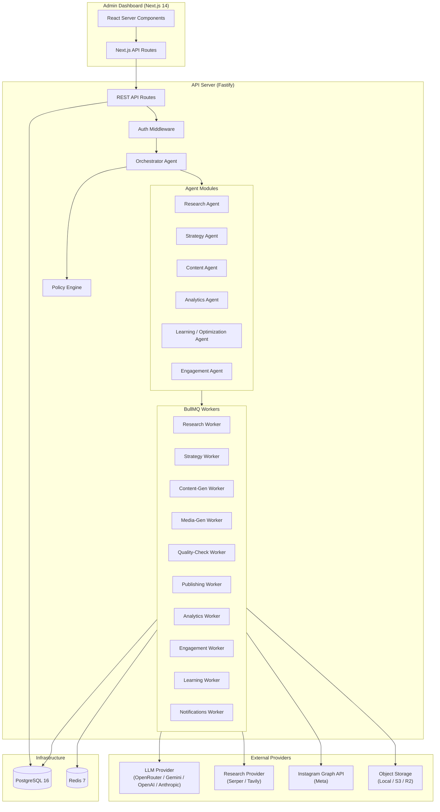
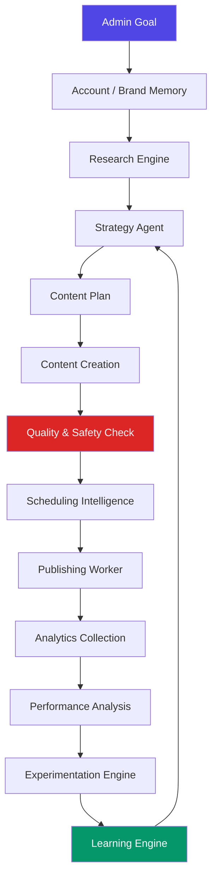
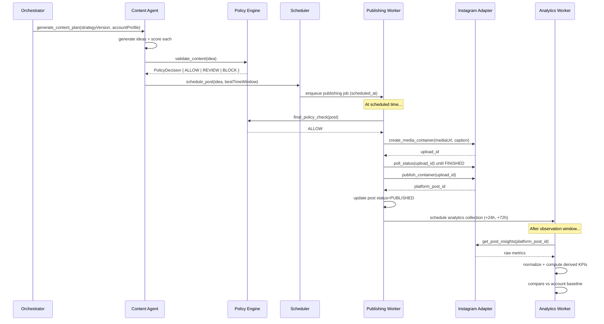

# Evolvr — Architecture

> Last updated: September 2026 | Version: 0.1.0

---

## Overview

Evolvr is a **modular monolithic backend** with a Next.js dashboard frontend, connected by a typed REST API. The system's intelligence lives in a set of specialized agent modules coordinated by a central orchestrator, all backed by persistent PostgreSQL state and asynchronous BullMQ workers.

### Core Architecture Principle

```
The LLM is a reasoning component inside a larger deterministic system.
Deterministic code handles: scheduling, KPI calculations, state transitions,
rate limits, retries, idempotency, policy enforcement, authorization.
LLMs handle: synthesis, reasoning, generation, interpretation, hypothesis generation.
```

---

## System Diagram



---

## Autonomous Closed Loop



---

## Module Responsibilities

### Orchestrator (`/modules/agent/orchestrator`)
- Determines current objective from admin goal and account state
- Inspects system state across all modules
- Decides which autonomous workflows need to run
- Delegates to specialized agents/workers
- Maintains agent run state
- Enforces policy and autonomy level
- Records all significant decisions

### Research Module (`/modules/research`)
- Goal-directed research (not just "what's trending")
- Categories: trend, competitor, audience, content, platform_update
- Research questions generated from current strategic uncertainty
- All findings structured with source attribution
- Research freshness management (expire + refresh stale data)

### Strategy Module (`/modules/strategy`)
- Translates admin goals into measurable objectives
- Defines content pillars, mix, cadence, KPI hierarchy
- Maintains versioned strategy history
- Revises strategy only when evidence supports changes
- Manages experiment hypotheses

### Content Module (`/modules/content`)
- Generates ideas mapped to: goal → pillar → audience pain → angle → format → hook → CTA
- Multi-dimension scoring (strategy fit, audience fit, novelty, predicted reach/engagement, brand safety)
- Caption, script, and carousel outline generation
- Asset brief generation (for media providers)

### Policy Engine (`/modules/policies`)
- Implements risk classification for every action
- Returns structured `PolicyDecision` (ALLOW / REVIEW / BLOCK)
- Checks: brand voice, factuality, sensitive topics, duplicates, spam, media validity
- Respects configured autonomy mode (Manual / Supervised / Autonomous)

### Publishing Module (`/modules/publishing`)
- Idempotent publishing worker
- Handles two-step Instagram container publish flow
- Exponential backoff on failures
- Records platform post IDs
- Schedules follow-up analytics collection jobs

### Analytics Module (`/modules/analytics`)
- Pulls account and post metrics from platform API
- Normalizes raw metrics
- Computes derived KPIs (engagement rate, save rate, etc.)
- Compares against historical baselines
- Detects anomalies
- Preserves raw API payloads

### Experiments Module (`/modules/experiments`)
- Creates controlled experiments (1 variable at a time)
- Assigns content ideas to control/treatment variants
- Measures outcomes at experiment end
- Updates hypothesis status (confirmed/rejected)
- Feeds conclusions into learning engine

### Learning Module (`/modules/learning`)
- Identifies performance patterns
- Updates insight confidence scores
- Proposes strategy changes (with evidence threshold)
- Promotes winning tactics, retires weak ones
- All knowledge stored as structured `StrategicInsight` records

### Engagement Module (`/modules/engagement`)
- Ingests comments from platform
- Classifies by sentiment, intent, risk
- Drafts contextual responses
- Auto-replies low-risk comments per policy (if enabled)
- Never fabricates facts in responses

---

## Memory Architecture

```mermaid
graph LR
    subgraph ShortTerm["Short-Term (Run Context)"]
        RT[Current task]
        RR[Current research]
        RA[Recent analytics]
        RS[Current strategy]
    end

    subgraph Episodic["Episodic (Historical Events)"]
        EP[Published posts]
        EE[Experiment results]
        EC[Strategy changes]
        EV[Audience events]
    end

    subgraph Semantic["Semantic Strategic Memory"]
        SH[High-performing hooks]
        SW[Winning content themes]
        SP[Audience pain points]
        ST[Best time windows]
        SF[Failed tactics]
        SC[Policy constraints]
    end

    ORCH[Orchestrator] -->|loads at run start| ShortTerm
    ShortTerm -->|queries selectively| Episodic
    ShortTerm -->|queries selectively| Semantic
    Episodic -->|updates| Semantic
```



---

## Queue Architecture

| Queue | Purpose | Workers |
|-------|---------|---------|
| `research` | Web search + synthesis | Research Worker |
| `strategy` | Strategy evaluation + revision | Strategy Worker |
| `content-generation` | Idea + copy + caption generation | Content Worker |
| `media-generation` | Image/video asset generation | Media Worker |
| `quality-check` | Policy + safety evaluation | QC Worker |
| `publishing` | Instagram publish + status poll | Publishing Worker |
| `analytics` | Metrics ingestion + calculation | Analytics Worker |
| `engagement` | Comment fetch + classify + reply | Engagement Worker |
| `learning` | Insight + strategy update | Learning Worker |
| `notifications` | In-app notifications | Notifications Worker |

---

## Data Flow: Content From Idea to Published



---

## Security Architecture

- All social OAuth tokens encrypted at rest with AES-256-GCM
- JWT for admin auth (httpOnly cookies)
- Rate limiting on all API endpoints
- Webhook signature validation
- No secrets in logs or responses
- All LLM tool calls schema-validated before execution
- Policy engine gate before every external action

---

## Scaling Considerations (V1)

V1 is a modular monolith suitable for a single server/VPS. The clear module boundaries mean that if the system needs to scale later, each module can become a separate service. BullMQ queues are already designed for distributed worker scaling (add more workers pointing at the same Redis instance).
